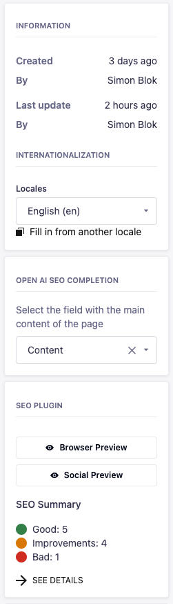

# Strapi plugin to generate SEO information using OpenAI

This plugin generates SEO information using OpenAI's API.
Based on the field with the main content on a page, SEO information is
generated when the 'generate' button is pressed.

- Provides custom fields for meta description and meta title
- Provides a 'fieldpicker' for selecting the main content field that is used to generate the SEO information
- OpenAI API-key can be set in the plugin settings (via .env file)

## Installation

```bash
yarn add @ef2/strapi-plugin-open-ai-seo-completion
```

Enable the plugin in `./config/plugins.js` by adding the following:

```js
'open-ai-seo-completion': {
  enabled: true,
  resolve: './src/plugins/open-ai-seo-completion',
  config: {
      apiToken: process.env.OPEN_AI_API_TOKEN
  }
}
```

Set your OpenAI API key in your `.env` file:

```dotenv
OPEN_AI_API_TOKEN=your-api-token
```

## Usage

1. Add a custom field to your SEO content type of type 'Open AI SEO Completion' and select which type of SEO information
   you want to generate.
2. On the content edit page, select the main content field that is used to generate the SEO information. All 'rich text
   fields' are available for selection. If there is a single rich text field on the page, it is automatically selected.
3. Press 'generate' at the field to generate the SEO information.

## Screenshots





